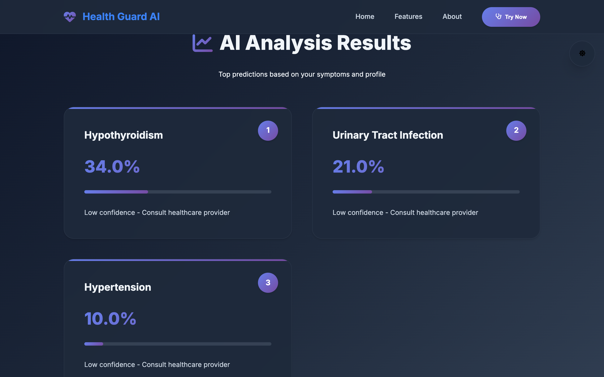

# Health Guard AI - Symptom-Based Disease Prediction

## Overview
The patient-profile dataset and `backend/train_model.py` are deprecated legacy material. The live app uses only `backend/artifacts/` generated by the research pipeline from the symptom-pattern dataset.

Model: RandomForestClassifier (100 trees)  
Backend: Flask API  
Frontend: Responsive HTML/CSS/JS  
ML Stack: scikit-learn, pandas, joblib  

## 📸 Application Screenshots

### 1. Hero Dashboard & Overview


### 2. Symptom Analysis & Disease Prediction Results


### 3. Dark Mode UI Preview


## Dataset Details
| Feature | Type | Values |
|---------|------|---------|
| Fever | Binary | Yes/No |
| Cough | Binary | Yes/No |
| Fatigue | Binary | Yes/No |
| Difficulty Breathing | Binary | Yes/No |
| Age | Numeric | 19-90 |
| Gender | Categorical | Male/Female |
| Blood Pressure | Categorical | Low/Normal/High |
| Cholesterol Level | Categorical | Low/Normal/High |
| Target | Multi-class (116 diseases) | Influenza, Asthma, Pneumonia... |

## Quick Start

### 1. Install Dependencies
```bash
cd HealthGuardAI
pip install -r requirements.txt
```

### 2. Train Model
```bash
cd backend
python train_model.py
```
Output: model.pkl, encoder.pkl, metadata.pkl + prints features/classes

### 3. Run API Server
```bash
python app.py
```
URL: http://127.0.0.1:5000

### 4. Open Frontend
```bash
start frontend/index.html
```

## API Endpoints

**POST /predict**
```json
{
  \"symptoms\": [\"Fever\", \"Cough\"], 
  \"age\": 25, 
  \"gender\": \"Male\"
}
```
**Response**:
```json
{
  \"predictions\": [
    {\"disease\": \"Influenza\", \"confidence\": 0.85},
    {\"disease\": \"Bronchitis\", \"confidence\": 0.62}
  ],
  \"top_prediction\": \"Influenza\",
  \"disclaimer\": \"Not medical advice\"
}
```

**Test**:
```bash
curl -X POST http://127.0.0.1:5000/predict -H \"Content-Type: application/json\" -d \"{\\\"symptoms\\\": [\\\"Fever\\\", \\\"Cough\\\"], \\\"age\\\": 25}\"
```

## Frontend Features
- Responsive design (mobile/desktop)
- Symptom suggestions
- Loading spinner
- Confidence progress bars
- Error handling
- Disclaimer

## Model Performance
- Dataset: 349 samples, 116 classes
- Features: 4 binary symptoms + 4 profile vars
- Preprocessing: OneHotEncoder (symptoms/profile), passthrough (Age)
- Training: Full dataset (no split for small classes)

## Tech Stack
```
Backend: Python 3.12, Flask 3.0, scikit-learn 1.5
Frontend: HTML5, CSS3, Vanilla JS
ML: RandomForestClassifier, ColumnTransformer, LabelEncoder
```

## Project Structure
```
HealthGuardAI/
├── backend/
│   ├── app.py           # Flask API
│   ├── train_model.py   # Training script
│   ├── model.pkl        # Trained model
│   ├── encoder.pkl      # Label encoder
│   └── metadata.pkl     # Feature info
├── frontend/
│   ├── index.html
│   ├── style.css
│   └── script.js
├── dataset/
│   └── Disease_symptom...csv
├── requirements.txt
└── README.md
```

## Limitations & Disclaimer
- Educational prototype
- Not medical advice - consult professionals
- 4 symptoms only (dataset limitation)
- Handles unknown inputs gracefully

## Troubleshooting
```
Flask not found → python app.py
Model not found → rerun train_model.py
CORS error → flask-cors installed
```

Ready for production demo! All specs implemented.
