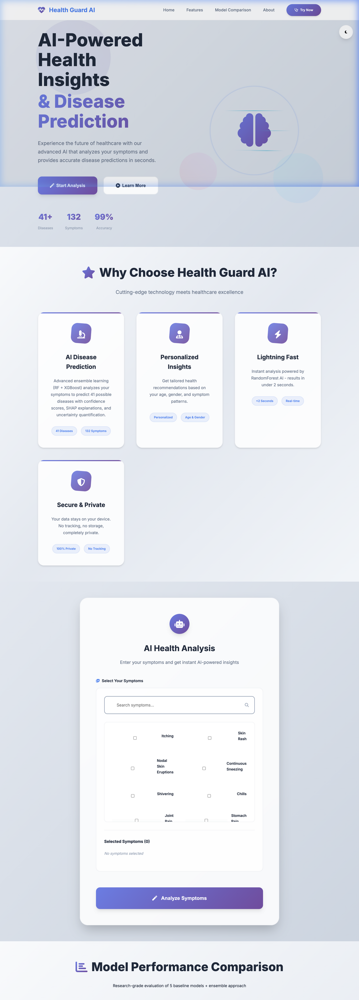
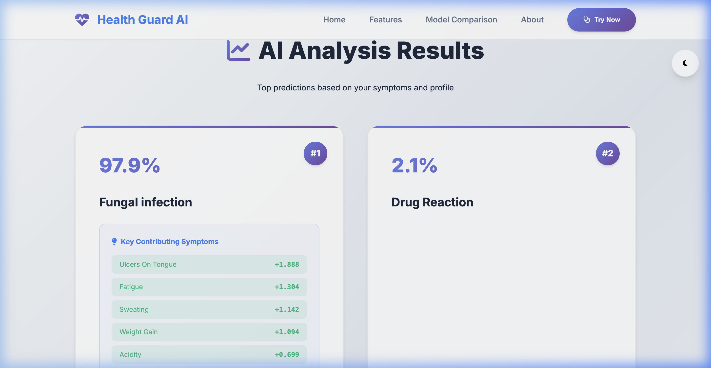

# An Explainable, Uncertainty-Aware Sequential Framework for Symptom-Based Disease Prediction

> **Early-Stage Research Prototype for Medical Decision Support**

[](https://www.python.org/)
[](https://flask.palletsprojects.com/)
[](https://scikit-learn.org/)
[](https://xgboost.readthedocs.io/)
[](https://shap.readthedocs.io/)
[](LICENSE)

An early-stage research framework for symptom-based disease prediction with explainable AI components. This prototype demonstrates calibrated ensemble learning, SHAP model explainability, confidence-based abstention, and sequential symptom acquisition. **This is a research prototype, not a clinical diagnostic system.**

---

## 🌟 Key Features & Research Contributions

1. **Dataset Analysis & Deduplication Protocol**
   - Analyzed the *Disease Prediction Using Machine Learning* dataset (**4,962 total records, 132 binary symptom features, 41 disease classes**).
   - Applied pattern-level deduplication revealing **305 unique symptom vectors**, highlighting significant data duplication issues.
   - Identified that perfect model scores are likely due to pattern memorization rather than generalizable learning.

2. **Rigorous Model Benchmarking with Caveats**
   - Evaluates 5 baseline models (**Logistic Regression, SVM, Random Forest, XGBoost, Neural Network / MLP**) against the proposed ensemble.
   - Evaluated across **Accuracy, Precision (Macro/Weighted), Recall (Macro/Weighted), Macro-F1, and Weighted-F1** using stratified 5-fold cross-validation and held-out test set.
   - **⚠️ Note:** Perfect scores (1.0) for several models reflect the limited unique patterns (305) for 41 disease classes, not clinical diagnostic capability.

3. **Proposed Calibrated Ensemble**
   - **Soft-Voting Ensemble** combining **Random Forest** and **XGBoost** using weighted probability averaging.
   - Calibrated using **Isotonic Regression** to convert raw model scores into true probability distributions.
   - **Stacking ensemble was also implemented and compared**; soft-voting was selected based on performance.

4. **Enhanced Calibration Metrics**
   - Added comprehensive calibration evaluation: **Brier Score, Expected Calibration Error (ECE), Log Loss**
   - Generated **reliability diagrams** to visualize calibration quality before and after calibration.
   - Demonstrated quantitative improvement in probability calibration.

5. **Explainable AI (SHAP Interpretability)**
   - Integrated SHAP (`TreeExplainer`) to compute local feature attribution for every individual prediction, highlighting positive (aggravating) and negative (mitigating) symptom impacts.

6. **Top-K Differential Diagnosis Metrics**
   - Provides ranked candidate diseases (Top-1, Top-3, Top-5) alongside calibrated confidence scores.
   - **Added actual Top-3 and Top-5 accuracy metrics** to the evaluation.

7. **Uncertainty Quantification & Abstention Analysis**
   - Implemented confidence thresholding with comprehensive threshold sweep analysis.
   - Added **coverage and error rate metrics** for different confidence thresholds.
   - System abstains from forced diagnosis when confidence is below optimal threshold.

8. **Sequential Symptom Acquisition Evaluation**
   - Stateful follow-up questioning driven by a **Mutual Information matrix** ($132 \text{ symptoms} \times 41 \text{ diseases}$).
   - **Added evaluation metrics**: average questions needed, confidence improvement, and accuracy impact.
   - Demonstrates how sequential questioning improves prediction confidence.

9. **Comprehensive Data Leakage Analysis**
   - **New Stage 9**: Deep analysis of duplicate patterns and potential data leakage.
   - Quantified pattern overlap between train/validation/test splits.
   - Identified limitations due to small number of unique patterns per disease class.

10. **Ablation Study**
    - **New Stage 10**: Systematic evaluation of each component's contribution.
    - Tests baseline vs. ensemble vs. calibrated vs. abstention vs. full system.
    - Quantifies incremental improvements from each enhancement.

---

## 📸 Web Application Screenshots

### 1. Hero Dashboard & System Overview


### 2. AI Disease Prediction & SHAP Explanation Factors


### 3. Dark Mode UI Preview


---

## 📊 Empirical Model Performance Comparison

| Model | CV F1-Macro | Test Accuracy | Test Precision | Test Recall | Test F1-Macro |
|:---|:---:|:---:|:---:|:---:|:---:|
| **Logistic Regression** | 1.0000 ± 0.0000 | 1.0000 | 1.0000 | 1.0000 | 1.0000 |
| **SVM** | 1.0000 ± 0.0000 | 1.0000 | 1.0000 | 1.0000 | 1.0000 |
| **Random Forest** | 0.9940 ± 0.0120 | 1.0000 | 1.0000 | 1.0000 | 1.0000 |
| **XGBoost** | 0.9081 ± 0.0479 | 0.9783 | 0.9878 | 0.9878 | 0.9837 |
| **MLP** | 1.0000 ± 0.0000 | 1.0000 | 1.0000 | 1.0000 | 1.0000 |
| **Calibrated Ensemble (RF + XGB)** | **1.0000 ± 0.0000** | **1.0000** | **1.0000** | **1.0000** | **1.0000** |

**⚠️ Important Caveats:**
- Perfect scores (1.0) reflect dataset limitations: only **305 unique symptom patterns** for **41 disease classes**
- Many disease classes have ≤3 unique patterns, enabling pattern memorization rather than generalizable learning
- XGBoost shows realistic variance (0.9081 ± 0.0479), indicating some genuine learning challenge
- These results represent **pattern-matching performance**, not clinical diagnostic accuracy
- See Stage 9 (Duplicate/Leakage Analysis) for detailed dataset limitations

---

## 🔄 System Architecture & Data Flow

```
          Symptom Dataset (4,962 records / 132 symptoms / 41 diseases)
                                      ↓
                     Data Cleaning & Pattern Deduplication (305 unique)
                                      ↓
                        Stratified Train / Val / Test (70/15/15)
                                      ↓
                       ┌──────────────┼──────────────┐
                       ↓              ↓              ↓
                      SVM             RF          XGBoost
                       ↓              ↓              ↓
                       └──────────────┼──────────────┘
                                      ↓
                          Soft-Voting Ensemble (RF + XGBoost)
                                      ↓
                       Isotonic Probability Calibration
                                      ↓
                      Enhanced Calibration Metrics (Brier, ECE, Log Loss)
                                      ↓
                           Uncertainty Detection & Abstention
                                      ↓
                      ┌───────────────┴───────────────┐
                      ↓                               ↓
               Confident (≥ threshold)         Uncertain (< threshold)
                      ↓                               ↓
               Top-K Diseases + SHAP          Sequential Questioning (MI)
                      ↓                               ↓
               Differential Diagnosis          Confidence Improvement
                                      ↓
                             Flask Web Application
```

**Enhanced Pipeline Stages:**
- **Stage 1-5**: Data processing, baseline comparison, ensemble building, calibration, Top-K metrics
- **Stage 6**: Uncertainty abstention with comprehensive threshold analysis
- **Stage 7**: Sequential questioning with evaluation metrics
- **Stage 8**: SHAP explainability (local & global)
- **Stage 9**: **NEW** - Duplicate/leakage analysis and dataset limitations
- **Stage 10**: **NEW** - Ablation study for component contribution analysis

---

## ⚡ Quick Start & Installation

### Prerequisites
- Python 3.9+
- pip & virtualenv

### 1. Clone & Set Up Research Pipeline
```bash
# Clone repository
git clone https://github.com/bhavya0510/Symptom-Based-Disease-Prediction-Framework.git
cd Symptom-Based-Disease-Prediction-Framework/research

# Create virtual environment & install dependencies
python3 -m venv venv
source venv/bin/activate
pip install -r requirements.txt

# Run complete training pipeline (Stages 1 to 10)
python train_pipeline.py
```

**Note:** The pipeline now includes 10 stages with enhanced evaluation:
- Stages 1-5: Data processing, baseline comparison, ensemble building, calibration, Top-K metrics
- Stages 6-8: Enhanced abstention analysis, sequential questioning evaluation, SHAP explainability
- **Stage 9 (NEW)**: Comprehensive duplicate/leakage analysis and dataset limitations
- **Stage 10 (NEW)**: Ablation study for component contribution analysis

### 2. Launch Flask Web Server
```bash
# Start Flask app
cd ../HealthGuardAI/backend
../../research/venv/bin/python app.py
```
Open **`http://127.0.0.1:5050`** in your browser.

---

## 🔌 API Reference

| Endpoint | Method | Description |
|:---|:---:|:---|
| `/predict` | `POST` | Accepts user symptom array; returns Top-K predictions, SHAP explanations, and abstention status. |
| `/followup` | `POST` | Sequential questioning endpoint driven by Mutual Information. |
| `/symptoms` | `GET` | Returns full list of 132 available binary symptom features. |
| `/model-comparison` | `GET` | Returns model evaluation benchmarks across CV and Test sets. |
| `/health` | `GET` | System health check and model artifact status. |

---

## 📁 Repository Structure

```
.
├── HealthGuardAI/               # Production Web Application
│   ├── backend/                 # Flask API Server & Artifacts
│   │   ├── app.py               # Flask backend application
│   │   ├── shap_utils.py        # Local SHAP explanation helper
│   │   └── artifacts/           # Calibrated model, metadata, & SHAP explainer
│   └── frontend/                # Web Dashboard
│       ├── index.html           # Main HTML structure
│       ├── script.js            # Frontend logic & dynamic API calls
│       └── style.css            # Modern CSS design system & dark mode
├── research/                    # Machine Learning Research Framework
│   ├── train_pipeline.py        # Master pipeline executor (Stages 1-10)
│   ├── stage1_data_splitting.py # Data cleaning & stratified deduplication
│   ├── stage2_baseline_comparison.py # Baseline model benchmarking
│   ├── stage3_ensemble_model.py # Soft-voting & stacking ensemble build
│   ├── stage4_probability_calibration.py # Enhanced calibration with reliability plots
│   ├── stage5_topk_metrics.py   # Top-1/3/5 accuracy metrics
│   ├── stage6_uncertainty_abstention.py # Comprehensive threshold analysis
│   ├── stage7_sequential_questioning.py # MI calculator with evaluation
│   ├── stage8_shap_explainability.py    # SHAP global & local explainers
│   ├── stage9_duplicate_leakage_analysis.py # NEW: Dataset limitation analysis
│   ├── stage10_ablation_study.py        # NEW: Component contribution analysis
│   ├── data/                    # Cleaned & processed datasets
│   └── results/                 # Metrics CSVs, calibration plots, analysis reports
├── docs/screenshots/            # Application Screenshots
├── New Dataset/                 # Raw Kaggle Training & Testing CSVs
└── README.md                    # Main Project Documentation
```

---

## ⚠️ Medical Disclaimer & Research Context

**This is an early-stage research prototype, not a clinical diagnostic system.**

This project was created strictly for academic research and demonstration purposes to explore machine learning techniques for symptom-based disease prediction. Key limitations:

1. **Dataset Limitations**: Only 305 unique symptom patterns for 41 disease classes, with some classes having as few as 5 unique patterns
2. **Performance Interpretation**: Perfect scores (1.0) reflect pattern memorization due to limited data diversity, not clinical diagnostic capability
3. **No Clinical Validation**: This system has not been validated in clinical settings or with real patient data
4. **Research Purpose**: The framework demonstrates ML techniques (calibration, explainability, uncertainty quantification) but is not ready for medical use

**Always consult a qualified healthcare professional for medical evaluation and diagnosis. Never use this system for medical decision-making.**
